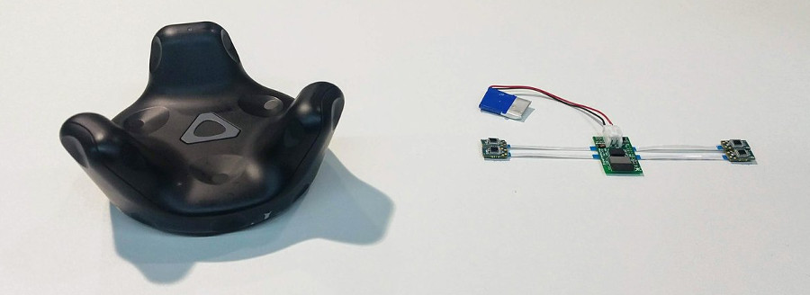

This project is about a miniaturization of the Vive Tracker by HTC.
It allows sub-millimetric 3d positioning, and embeds a 9DoF IMU with sensor fusion.
The entire project is open source, all the materials can be found below.

This project is a work in progress, and this page is still in construction, but a few links are already available:

_______________________________________________________________________________
## Hardware
[https://upverter.com/HiveTracker](https://upverter.com/HiveTracker)

_______________________________________________________________________________
## Firmware / Software

Our repos include several developments and test bricks, from benchmark to web Bluetooth proof of concepts,
we try to document each step of our experimentations:

[https://github.com/HiveTracker](https://github.com/HiveTracker)

_______________________________________________________________________________
## Publications
[AH18](http://sigah.org/AH2018) -
_HIVE Tracker: a tiny, low-cost, and scalable device for sub-millimetric 3D positioning._
  Darío R. Quiñones, Gonçalo Lopes, Danbee Kim, Cédric Honnet, David Moratal, and Adam Kampf
  [DOI](https://doi.org/10.1145/3174910.3174935) -
[Open Access](files/AH18-HiveTracker.pdf)

_______________________________________________________________________________
## Contact

- Twitter: [@hive_tracker](https://twitter.com/hive_tracker)

- Forum: [https://groups.google.com/forum/#!forum/hivetracker](https://groups.google.com/forum/#!forum/hivetracker)

- Team email: [hivetracker+owners@googlegroups.com](mailto:hivetracker+owners@googlegroups.com)

